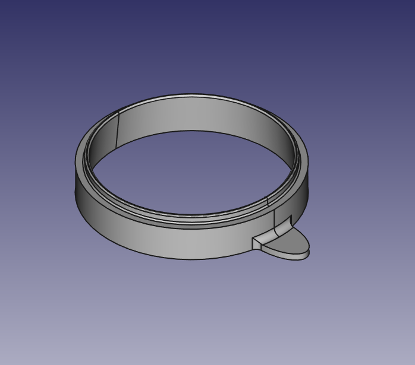

# Coffee Dripper Spacer

A spacer specifically for my coffee dripper.

## Requirements

- FreeCAD

## Tips

PLA+ (and possibly ABS) works fine. PLA should be possible, but make sure the
physical strength is enough.

Use 0.28 mm `Layer Height` for speed.

`Infill Density` is 50%.

Use `Tri-Hexagon` infill pattern.

Enable `Connect Infill Lines`.

## Authors

- [Tomoyuki Sakurai](https://github.com/trombik)

## License

ISC. See {LICENSE](LICENSE) for details.
